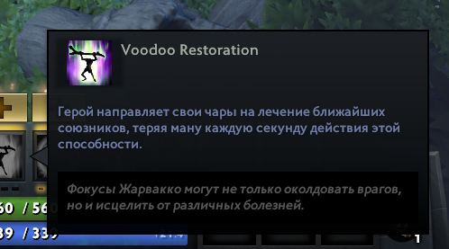

# Dota Ability Tooltip

[](https://www.npmjs.com/package/dota-ability-tooltip)


## Description
A small script that allows you to replace the standard dota 2 ability tooltips with custom ones.



## Prepare
1. Install [Node.js](https://nodejs.org/en/) (You need LTS version)
2. Install [Vs Code](https://code.visualstudio.com/download)

## Getting Started
### Variant 1
1. Open Terminal in Vs Code (default Ctrl+Shift+`)
2. Install package (enter command in terminal) `npm i dota-ability-tooltip`
3. Enter command in terminal `npm run build` after that will be generated file `build/index.js`
4. Copy this file `build/index.js` in our `panorama/scripts...`
5. Include `index.js` in XML
```xml
    <scripts>
        <!-- Included JS script files go here -->
        <include src="file://{resources}/scripts/custom_game/index.js" />
    </scripts>

    <script>
        const config = {
            xmlTooltip: 'TOOLTIP PATH'
        }
        AbilitiesTooltipInject(config)
    </script>
```
### Variant 2
1. Open Terminal in Vs Code (default Ctrl+Shift+`)
2. Install package (enter command in terminal) `npm i dota-ability-tooltip`
3. Importing method `registerAbilitiesTooltip` from package. [template](https://github.com/HappyFeedFriends/DotaAbilityTooltip/blob/master/example/index.ts) 

## For Development
1. Run command `npm run dev`

## Parametrs

```ts
interface TooltipConfig {
    // The function that displays the custom tooltip 
    // Return true to show custom tooltip
    // Not necessarily
    isShown?: (abilityIndex: AbilityEntityIndex) => boolean;
    // Path to XML file custom tooltip
    // @example "file://{resources}/layout/custom_game/tooltips/towers_tooltip.xml"
    xmlTooltip: string;
    // Event on show custom tooltip
    // Not necessarily
    onShown?: (parentPanel: Panel, abilityEntityIndex: AbilityEntityIndex) => void;
}
```

## Feature

1. Add tooltips for items

## Contents
- [packages/DotaAbilityTooltip] - source code
- [game | content] - for only development
- [example] - example
